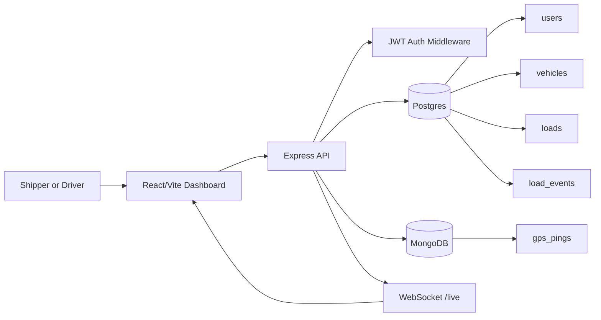

# Freightline

A freight operations portfolio project that models a Ryan/ProTransport-style logistics workflow: shippers post loads, drivers register trucks, drivers accept eligible freight, and both roles inspect active work on a live map. Built with React, Node/Express, Postgres, MongoDB, and WebSockets.

> **Live demo:** https://freightline-app.vercel.app
> **API:** https://freightline-app-production.up.railway.app
>
> Sign in as `demo.shipper@freightline.local` / `secret123` to post and cancel loads.
> Sign in as `demo.driver@freightline.local` / `secret123` to register a truck, accept freight, and move loads through delivery.
>
> Note: Railway's free tier cold-starts; the first request can take about 10 seconds to warm up.


*Live GPS tracking: the truck marker turns red and the exception rail fires when a driver deviates more than 75 miles from the expected corridor.*


*Driver view: eligible freight with one-click accept and status transitions.*

## Try it in 90 seconds

1. Open the live demo and sign in as the **shipper**.
2. Click **Post load**, choose a demo lane, and submit it.
3. Log out, sign in as the **driver**, and click **Register truck** with the default capacity.
4. Click **Accept** on the new load, then **Start** to mark it in transit.
5. Keep the driver dashboard open while the GPS simulator runs from a local terminal. Use the deployed API command in Local Setup if you want to drive the live demo.

## Architecture



Postgres owns transactional freight records: users, vehicles, loads, ownership rules, and ACID-guarded status transitions. MongoDB stores append-heavy GPS pings so live tracking can scale independently of the relational workflow.

This project is inspired by public logistics workflows from Shamrock Trading Corporation brands such as [Ryan Transportation](https://www.ryantrans.com/) and [ProTransport](https://www.pro-transport.com/). It is not affiliated with, endorsed by, or branded as Shamrock Trading Corporation.

## Current V1 Workflows

- **Shippers** can register, log in, post loads, edit posted-load rates, cancel posted loads, and view load timelines.
- **Drivers** can register, log in, register trucks, view posted freight, accept freight when their vehicle is eligible, and move assigned freight through `assigned -> in_transit -> delivered`.
- Assigned drivers submit GPS pings; shippers and assigned drivers see live map markers and tracking exceptions.
- Drivers can upload proof-of-delivery JPEG, PNG, or PDF documents through short-lived S3 presigned URLs; shippers can view uploaded documents through signed download links.
- The frontend uses Leaflet and OpenStreetMap tiles with predefined demo lanes, so the app does not need a paid geocoding key.

## API Surface

- `POST /auth/register`, `POST /auth/login`, `GET /auth/me`
- `POST /vehicles`, `GET /vehicles/me`
- `POST /loads`, `GET /loads`, `GET /loads/:id`, `PATCH /loads/:id`
- `POST /loads/:id/assign`, `PATCH /loads/:id/status`
- `GET /loads/:id/events`
- `POST /loads/:id/pings`, `GET /loads/:id/pings?limit=50`
- `POST /loads/:id/documents/pod-upload-url`, `POST /loads/:id/documents/:doc_id/confirm`, `GET /loads/:id/documents`
- `GET /loads/live-state`
- `WS /live?token=<jwt>`

## Local Setup

### Backend

```bash
cd backend
npm install
cp .env.example .env
npm run dev
```

The backend reads AWS credentials and bucket name from `.env`. See `backend/.env.example` for the four `AWS_*` keys required for proof-of-delivery uploads.

### Frontend

```bash
cd frontend
npm install
npm run dev
```

The frontend points at `http://localhost:3000` by default. Set `VITE_API_URL` when using a deployed backend.

### Database migrations

```bash
psql -d freightline -f backend/db/migrations/001_create_users.sql
psql -d freightline -f backend/db/migrations/002_create_vehicles.sql
psql -d freightline -f backend/db/migrations/003_create_loads.sql
psql -d freightline -f backend/db/migrations/004_add_load_coordinates_and_events.sql
psql -d freightline -f backend/db/migrations/005_create_load_documents.sql
psql -d freightline -f backend/db/migrations/006_extend_load_events_pod_uploaded.sql
```

### MongoDB

The backend defaults to:

```bash
MONGODB_URI=mongodb://127.0.0.1:27017
MONGODB_DB=freightline
```

### Demo seed data

```bash
psql -d freightline -f backend/db/seed_demo.sql
```

Demo password for seeded users: `secret123`

- `demo.shipper@freightline.local`
- `demo.driver@freightline.local`

### Live GPS simulator

```bash
cd backend
npm run simulate:pings
npm run simulate:pings -- --off-route
```

If your terminal prompt already ends in `Freightline-App\backend`, skip the
`cd backend` line.

To point the simulator at the deployed Railway API:

```bash
cd backend
npm run simulate:pings -- --api https://freightline-app-production.up.railway.app --off-route
```

## Quality Checks

```bash
cd backend && npm test
cd frontend && npm run lint
cd frontend && npm test
cd frontend && npm run build
```

Backend tests use Jest + Supertest with global mocks of MongoDB and S3 boundaries, so test runs do not open real external connections. Frontend tests use Vitest + React Testing Library for core UI contracts. CI runs backend tests, frontend linting, frontend tests, and the frontend production build on every push via GitHub Actions.

## Architecture Decisions

**Why Postgres for loads and MongoDB for GPS pings — not one database?**
Load records are relational: a load belongs to a shipper, a vehicle belongs to a driver, an assignment ties them together with foreign-key constraints and ACID-safe status transitions. GPS pings are append-only, schema-flexible, and write-heavy — one ping every few seconds per active truck. Splitting the two databases means the relational workflow (assign, cancel, deliver) is never blocked by ping write throughput, and the ping store can be scaled or replaced independently. The `FOR UPDATE` row lock on the assignment transaction enforces correctness at the Postgres layer; MongoDB never needs to care about it.

**Why presigned S3 URLs instead of uploading through the API server?**
The API is a small Node process on Railway's free tier. If drivers uploaded proof-of-delivery files through it, every upload would sit on the event loop, blocking other requests for the duration of the transfer. Presigned URLs let the driver's browser upload directly to S3 in parallel with normal API traffic. The server only handles the lightweight steps: issuing the URL (one S3 API call) and confirming the upload via `HeadObject`. Binary data never touches Node.

**Why `SELECT ... FOR UPDATE` on the load assignment?**
Without a row lock, two drivers could both read a load as `posted` and both attempt to assign it at the same moment. Both reads would succeed, both updates would run, and the load would end up assigned to whichever driver's `UPDATE` committed last — with no error surfaced to the other driver. The `FOR UPDATE` lock ensures only one transaction can read-then-write the load row at a time. A second driver's transaction blocks until the first commits, then reads the now-`assigned` status and returns a 409.

**Why WebSockets for live tracking instead of polling?**
HTTP polling at one request per second per connected user is 60 requests per minute per user. With 10 shippers watching 5 loads each, that's 600 requests per minute of mostly-empty responses. The WebSocket connection is persistent: the server pushes a message only when a ping arrives, and only to the shipper and assigned driver for that specific load. Connection cost is one handshake; ongoing cost is proportional to actual ping volume, not viewer count.

## What I Would Build Next at Scale

- **GPS pings hit the API directly today.** At more than 100 trucks, I would move ingestion to a device-authenticated MQTT or Kafka path with the API as a downstream consumer, because direct HTTP creates write amplification on the API event loop and has no good way to absorb a reconnect storm.
- **Driver and carrier are the same entity in V1.** A real freight broker has carriers, each with multiple drivers and vehicles. Splitting them is a small schema change but a larger UX and permission-model change, so I kept V1 focused on the shipper-driver workflow.
- **POD uploads are stored in S3 but not virus-scanned.** For production, I would run an `s3:ObjectCreated` Lambda that hands the object to ClamAV before flipping the document from `uploaded` to `clean`.
- **Shipper UX assumes one shipper org per user.** Most freight brokers have a shipper company with multiple users. That would become a `companies` table, a `user_companies` join, and permission checks on top of the current role system.
- **No real geocoding yet.** The demo lanes have hard-coded coordinates because geocoding APIs cost money. A provider interface would let me swap Mapbox, HERE, or OSRM behind a feature flag.

Built by Jordan Umpierre as a portfolio project. License: MIT.
