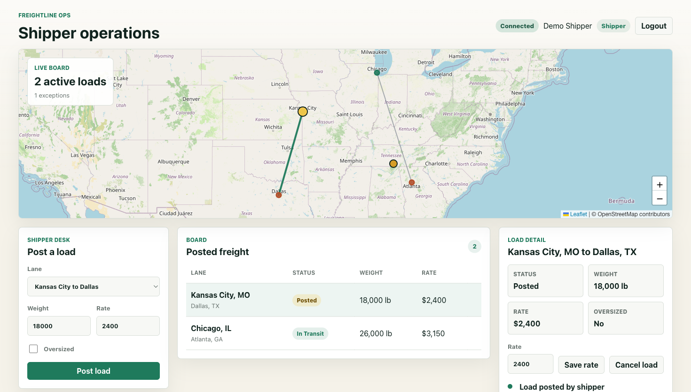
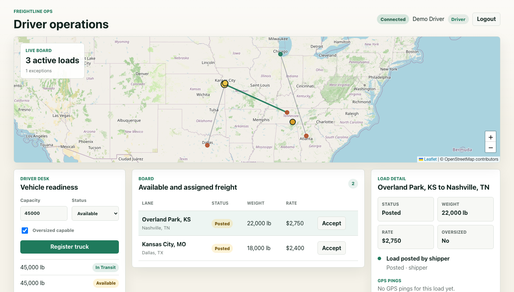
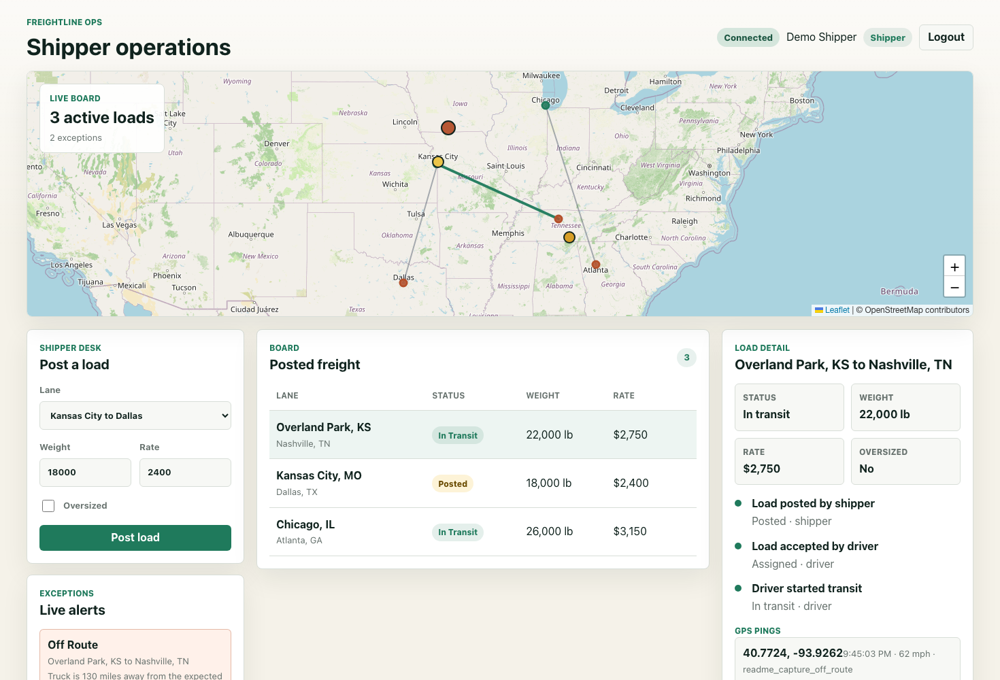
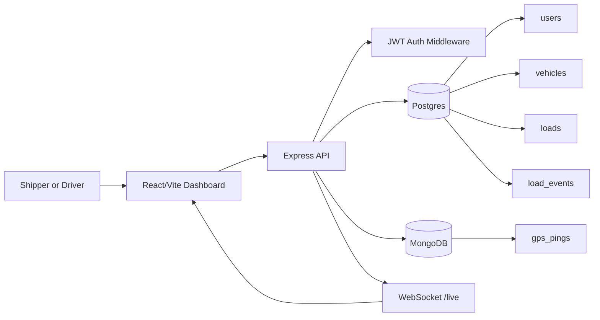

# Freightline

A full-stack freight operations platform where shippers post loads, drivers register trucks, drivers accept eligible freight, and both roles monitor active work on a live map. Built with React, Node/Express, PostgreSQL, MongoDB, AWS S3, and WebSockets.

> **Live demo:** https://freightline-app.vercel.app
> **API:** https://freightline-app-production.up.railway.app
>
> Sign in as `demo.shipper@freightline.local` / `secret123` to post and cancel loads.
> Sign in as `demo.driver@freightline.local` / `secret123` to register a truck, accept freight, and move loads through delivery.
>
> Note: Railway's free tier cold-starts; the first request can take about 10 seconds to warm up.


*Shipper view: posted and active freight on the live ops board.*


*Driver view: eligible freight with one-click accept and status transitions.*


*Live GPS tracking with an off-route exception flagged in real time.*

## Try it in 90 seconds

1. Open the live demo and sign in as the **shipper**.
2. Click **Post load**, choose a demo lane, and submit it.
3. Log out, sign in as the **driver**, and click **Register truck** with the default capacity.
4. Click **Accept** on the new load, then **Start** to mark it in transit.
5. Keep the driver dashboard open while the GPS simulator runs from a local terminal. Use the deployed API command in Local Setup if you want to drive the live demo.

## Architecture



Postgres owns transactional freight records: users, vehicles, loads, ownership rules, and ACID-guarded status transitions. MongoDB stores append-heavy GPS pings so live tracking can scale independently of the relational workflow.

## Current V1 Workflows

- **Shippers** can register, log in, post loads, edit posted-load rates, cancel posted loads, and view load timelines.
- **Drivers** can register, log in, register trucks, view posted freight, accept freight when their vehicle is eligible, and move assigned freight through `assigned -> in_transit -> delivered`.
- Assigned drivers submit GPS pings; shippers and assigned drivers see live map markers and tracking exceptions.
- Drivers can upload proof-of-delivery JPEG, PNG, or PDF documents through short-lived S3 presigned URLs; shippers can view uploaded documents through signed download links.
- The frontend uses Leaflet and OpenStreetMap tiles with predefined demo lanes, so the app does not need a paid geocoding key.

## API Surface

- `POST /auth/register`, `POST /auth/login`, `GET /auth/me`
- `POST /vehicles`, `GET /vehicles/me`
- `POST /loads`, `GET /loads`, `GET /loads/:id`, `PATCH /loads/:id`
- `POST /loads/:id/assign`, `PATCH /loads/:id/status`
- `GET /loads/:id/events`
- `POST /loads/:id/pings`, `GET /loads/:id/pings?limit=50`
- `POST /loads/:id/documents/pod-upload-url`, `POST /loads/:id/documents/:doc_id/confirm`, `GET /loads/:id/documents`
- `GET /loads/live-state`
- `WS /live?token=<jwt>`

## Local Setup

### Backend

```bash
cd backend
npm install
cp .env.example .env
npm run dev
```

The backend reads AWS credentials and bucket name from `.env`. See `backend/.env.example` for the four `AWS_*` keys required for proof-of-delivery uploads.

### Frontend

```bash
cd frontend
npm install
npm run dev
```

The frontend points at `http://localhost:3000` by default. Set `VITE_API_URL` when using a deployed backend.

### Database migrations

```bash
psql -d freightline -f backend/db/migrations/001_create_users.sql
psql -d freightline -f backend/db/migrations/002_create_vehicles.sql
psql -d freightline -f backend/db/migrations/003_create_loads.sql
psql -d freightline -f backend/db/migrations/004_add_load_coordinates_and_events.sql
psql -d freightline -f backend/db/migrations/005_create_load_documents.sql
psql -d freightline -f backend/db/migrations/006_extend_load_events_pod_uploaded.sql
```

### MongoDB

The backend defaults to:

```bash
MONGODB_URI=mongodb://127.0.0.1:27017
MONGODB_DB=freightline
```

### Demo seed data

```bash
psql -d freightline -f backend/db/seed_demo.sql
```

Demo password for seeded users: `secret123`

- `demo.shipper@freightline.local`
- `demo.driver@freightline.local`

### Live GPS simulator

```bash
cd backend
npm run simulate:pings
npm run simulate:pings -- --off-route
```

To point the simulator at the deployed Railway API:

```bash
cd backend
API_URL=https://freightline-app-production.up.railway.app npm run simulate:pings -- --off-route
```

## Quality Checks

```bash
cd backend && npm test
cd frontend && npm run lint
cd frontend && npm test
cd frontend && npm run build
```

Backend tests use Jest + Supertest with global mocks of MongoDB and S3 boundaries, so test runs do not open real external connections. Frontend tests use Vitest + React Testing Library for core UI contracts. CI runs backend tests, frontend linting, frontend tests, and the frontend production build on every push via GitHub Actions.

## Scaling Notes

- **GPS ingestion:** Direct API writes work for the demo, but a larger fleet would benefit from device-authenticated MQTT or Kafka ingestion so reconnect storms do not overload the API event loop.
- **Carrier modeling:** V1 treats driver and carrier as one entity. A production brokerage workflow would separate carriers, drivers, vehicles, and organization-level permissions.
- **Proof-of-delivery scanning:** POD files are stored in S3 through presigned uploads. A production path would scan new objects before making them available for download.
- **Shipper organizations:** V1 assumes one shipper account per user. Multi-user shipper companies would add company tables, membership records, and organization-scoped authorization.
- **Geocoding:** Demo lanes use fixed coordinates to avoid paid geocoding. A provider interface would allow Mapbox, HERE, OSRM, or another routing provider behind a feature flag.

License: MIT.
