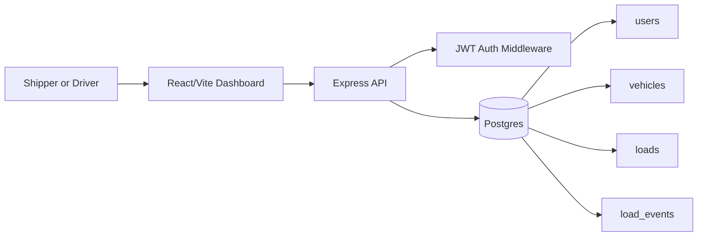

# Freightline

Freightline is a freight operations portfolio project built with React, Node/Express, and Postgres. It models a Ryan/FLEX-style workflow: shippers post loads, drivers register trucks, drivers accept eligible freight, and both roles can inspect active work on a map/status board.

This project is inspired by public logistics workflows from Shamrock Trading Corporation brands such as [Ryan Transportation](https://www.ryantrans.com/) and [ProTransport](https://www.pro-transport.com/). It is not affiliated with, endorsed by, or branded as Shamrock Trading Corporation.

## Why This Exists

The goal is to show end-to-end product judgment for transportation software:

- Role-based JWT auth for shippers and drivers
- Relational freight data with clear ownership rules
- Guardrails around vehicle capacity, oversized freight, and load status transitions
- A React operations dashboard with map visibility
- Tests and CI that prove the main API behaviors

## Architecture



MongoDB is intentionally out of the core v1. The Postgres `load_events` table handles the demo timeline, while a production-scale GPS ping stream would move to an append-heavy MongoDB or event pipeline.

## Current V1 Workflows

- `shipper` users can register, login, post loads, edit posted-load rates, cancel posted loads, and view their load timelines.
- `driver` users can register, login, register trucks, view posted freight, accept freight when their vehicle is eligible, and move assigned freight through `assigned -> in_transit -> delivered`.
- The frontend uses Leaflet and OpenStreetMap tiles with predefined demo lanes, so the app does not need a paid geocoding key.

## API Surface

- `POST /auth/register`
- `POST /auth/login`
- `GET /auth/me`
- `POST /vehicles`
- `GET /vehicles/me`
- `POST /loads`
- `GET /loads`
- `GET /loads/:id`
- `PATCH /loads/:id`
- `POST /loads/:id/assign`
- `PATCH /loads/:id/status`
- `GET /loads/:id/events`

## Local Setup

Backend:

```bash
cd backend
npm install
cp .env.example .env
npm run dev
```

Frontend:

```bash
cd frontend
npm install
npm run dev
```

Run database migrations manually against your local Postgres database:

```bash
psql -d freightline -f backend/db/migrations/001_create_users.sql
psql -d freightline -f backend/db/migrations/002_create_vehicles.sql
psql -d freightline -f backend/db/migrations/003_create_loads.sql
psql -d freightline -f backend/db/migrations/004_add_load_coordinates_and_events.sql
```

Seed demo data:

```bash
psql -d freightline -f backend/db/seed_demo.sql
```

Demo password for seeded users: `secret123`

- `demo.shipper@freightline.local`
- `demo.driver@freightline.local`

## Quality Checks

```bash
cd backend && npm test
cd frontend && npm run lint
cd frontend && npm run build
```

## What I Would Scale Next

- Move high-volume GPS pings from Postgres demo events to MongoDB or a streaming ingestion path.
- Add S3 presigned upload flows for proof-of-delivery documents.
- Add WebSockets for live board updates instead of client refreshes.
- Add real geocoding and route distance calculations behind a provider abstraction.
- Add separate carrier/company entities once the v1 driver-as-carrier simplification is no longer enough.
