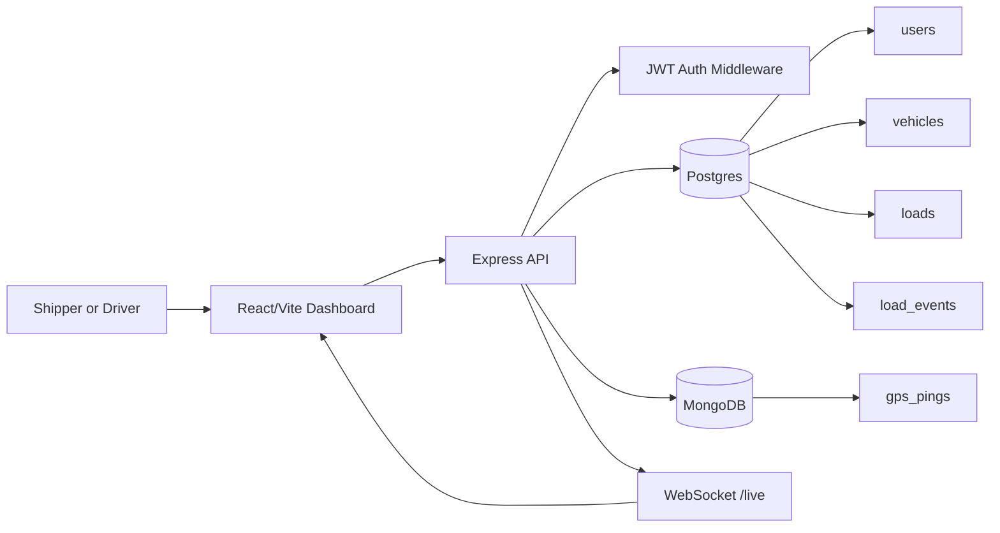

# Phase 2 — README & Demo Polish Implementation Plan

> **For agentic workers:** REQUIRED SUB-SKILL: Use superpowers:subagent-driven-development (recommended) or superpowers:executing-plans to implement this plan task-by-task. Steps use checkbox (`- [ ]`) syntax for tracking.

**Goal:** Make the first 30 seconds of a GitHub visitor's GitHub visit unambiguously good — visible demo links, screenshots, a 90-second try-it walkthrough, defensible "scale next" section, and no Vite-boilerplate README.

**Architecture:** Pure documentation. No application code changes. Three deliverables: top-level `README.md` rewrite, three screenshots in `docs/screenshots/`, and replacement of `frontend/README.md`.

**Tech Stack:** Markdown, the deployed live demo (for capturing screenshots), Preview.app (or any image tool) for cropping.

**Spec reference:** `docs/superpowers/specs/2026-05-11-freightline-documentation-polish-design.md` Phase 2.

**Prerequisite:** Phase 1 plan complete and CI green.

---

## File Structure

| File | Action | Responsibility |
|------|--------|----------------|
| `README.md` | Modify | Lead with demo block, screenshots, walkthrough; tighten "scale next" section. |
| `docs/screenshots/01-shipper-dashboard.png` | Create | Shipper view: map + load list + exception rail. |
| `docs/screenshots/02-driver-accept.png` | Create | Driver view with Accept/Start buttons visible. |
| `docs/screenshots/03-live-tracking.png` | Create | In-transit load with GPS marker and an off-route exception. |
| `frontend/README.md` | Replace | 5-line pointer to top-level README. |

---

## Task 1: Capture three demo screenshots

**Files:**
- Create: `docs/screenshots/01-shipper-dashboard.png`
- Create: `docs/screenshots/02-driver-accept.png`
- Create: `docs/screenshots/03-live-tracking.png`

These need a **live, populated app**. Use the deployed demo, not localhost — that way the screenshots match what a GitHub visitor actually sees when they click the link.

- [ ] **Step 1: Make sure the screenshots directory exists**

Run from repo root:
```bash
mkdir -p docs/screenshots
```

- [ ] **Step 2: Capture `01-shipper-dashboard.png`**

In a browser:
1. Go to https://freightline-app.vercel.app
2. Log in as `demo.shipper@freightline.local` / `secret123`
3. Wait for the dashboard to load (map + load list + exception rail)
4. Take a screenshot of the full window (Cmd-Shift-4 then spacebar then click on the browser window on macOS)
5. Crop to remove browser chrome (URL bar, tabs) — keep just the page itself
6. Save as `docs/screenshots/01-shipper-dashboard.png`. Target dimensions: roughly 1600×900, file under 500 KB.

- [ ] **Step 3: Capture `02-driver-accept.png`**

1. Log out, log in as `demo.driver@freightline.local` / `secret123`
2. The dashboard should show the available loads with **Accept** buttons for posted loads and **Start**/**Deliver** buttons for assigned loads
3. If no posted loads exist (because previous demo runs accepted them), log back in as the shipper and post one (any of the three demo lanes), then return as the driver
4. Capture, crop, save as `docs/screenshots/02-driver-accept.png`

- [ ] **Step 4: Capture `03-live-tracking.png`**

This one needs a load with an active GPS ping that's tagged as off-route, so the warning color shows on the map.

1. Stay logged in as the driver. If no load is in `in_transit` status, click **Accept** on a posted load, then **Start** on the assigned one
2. From the repo root, in another terminal, run the off-route simulator:
   ```bash
   cd backend && npm run simulate:pings -- --off-route
   ```
   (Requires local Mongo running and `.env` pointing at the deployed Postgres + Mongo, OR run against a local backend in dev. If running against the deployed app isn't workable, run the *whole* demo locally for this screenshot only — it's about visual fidelity, not which environment.)
3. Wait ~10 seconds for the off-route exception to register; the map marker should turn the warning color and the exception rail should populate
4. Capture, crop, save as `docs/screenshots/03-live-tracking.png`

- [ ] **Step 5: Verify all three exist and are reasonable size**

Run:
```bash
ls -lh docs/screenshots/
```

Expected: three files, each under 500 KB. If any are larger, run them through an optimizer (`pngquant` or https://tinypng.com).

---

## Task 2: Rewrite top-level `README.md`

**Files:**
- Modify: `README.md`

The new README leads with the demo, then shows what it looks like, then explains the architecture. Engineers and GitHub visitors scan top-down — the first screenful must do the heavy lifting.

- [ ] **Step 1: Replace `README.md` with the new structure**

Open `README.md` and replace its entire contents with:

````markdown
# Freightline

A freight operations portfolio project that models a freight operations logistics workflow: shippers post loads, drivers register trucks, drivers accept eligible freight, and both roles inspect active work on a live map. Built with React, Node/Express, Postgres, MongoDB, and WebSockets.

> 🚛 **Live demo:** https://freightline-app.vercel.app
> **API:** https://freightline-app-production.up.railway.app
>
> Sign in as `demo.shipper@freightline.local` / `secret123` (post & cancel loads)
> or `demo.driver@freightline.local` / `secret123` (register a truck, accept & deliver loads)
>
> Note: Railway's free tier cold-starts; the first request can take ~10 seconds to warm up.


*Shipper view — posted and active freight on the live ops board with exception rail.*


*Driver view — eligible freight with one-click accept and status transitions.*


*Live GPS tracking with an off-route exception flagged in real time.*

## Try it in 90 seconds

1. Open the **shipper** demo, click **Post load**, pick the Chicago→Atlanta lane, submit
2. Log out, open the **driver** demo, click **Register truck** with the default capacity
3. Click **Accept** on the new load, then **Start** to mark it in transit
4. Stay on this view to see the live tracking dot move once the simulator runs (see Local Setup below)

## Architecture



Postgres owns transactional freight records (foreign keys, ACID-guarded state transitions). MongoDB stores append-heavy GPS pings so live tracking scales independently of the relational workflow.

This project is inspired by public logistics workflows from . It is not affiliated with, endorsed by, or branded as freight operations domainoration.

## Current V1 Workflows

- **Shippers** can register, log in, post loads, edit posted-load rates, cancel posted loads, and view their load timelines
- **Drivers** can register, log in, register trucks, view posted freight, accept freight when their vehicle is eligible (capacity + oversized constraints), and move assigned freight through `assigned → in_transit → delivered`
- Assigned drivers submit GPS pings; shippers and assigned drivers see live map markers and tracking exceptions
- The frontend uses Leaflet and OpenStreetMap tiles with predefined demo lanes, so the app does not need a paid geocoding key

## API Surface

- `POST /auth/register`, `POST /auth/login`, `GET /auth/me`
- `POST /vehicles`, `GET /vehicles/me`
- `POST /loads`, `GET /loads`, `GET /loads/:id`, `PATCH /loads/:id`
- `POST /loads/:id/assign`, `PATCH /loads/:id/status`
- `GET /loads/:id/events`
- `POST /loads/:id/pings`, `GET /loads/:id/pings?limit=50`
- `GET /loads/live-state`
- `WS /live?token=<jwt>`

## Local Setup

### Backend

```bash
cd backend
npm install
cp .env.example .env
npm run dev
```

### Frontend

```bash
cd frontend
npm install
npm run dev
```

### Database migrations (Postgres)

```bash
psql -d freightline -f backend/db/migrations/001_create_users.sql
psql -d freightline -f backend/db/migrations/002_create_vehicles.sql
psql -d freightline -f backend/db/migrations/003_create_loads.sql
psql -d freightline -f backend/db/migrations/004_add_load_coordinates_and_events.sql
```

### MongoDB

The backend defaults to:
```
MONGODB_URI=mongodb://127.0.0.1:27017
MONGODB_DB=freightline
```

### Demo seed data

```bash
psql -d freightline -f backend/db/seed_demo.sql
```

Demo password for seeded users: `secret123`
- `demo.shipper@freightline.local`
- `demo.driver@freightline.local`

### Live GPS simulator

```bash
cd backend
npm run simulate:pings              # normal route
npm run simulate:pings -- --off-route   # trigger off-route exception
```

## Quality Checks

```bash
cd backend && npm test
cd frontend && npm run lint
cd frontend && npm test
cd frontend && npm run build
```

Backend tests use Jest + Supertest with a global mock of `db/mongo` so tests never touch a real Mongo. Frontend tests use Vitest + React Testing Library. CI runs all of these on every push via GitHub Actions.

## What I Would Build Next at Scale

- **GPS pings hit the API directly today.** At >100 trucks I'd move ingestion to a device-authenticated MQTT or Kafka path with the API as a downstream consumer, because direct HTTP creates write-amplification on the API event loop and there's no good way to absorb a network reconnect storm without a queue.
- **Driver and carrier are the same entity in v1.** A real freight broker has carriers (the company), each with multiple drivers and vehicles. Splitting them is a 1-day schema change and a multi-week UX change — deliberate v1 cut.
- **POD uploads are stored in S3 but not virus-scanned.** For prod I'd run a `s3:ObjectCreated` Lambda that hands the object to ClamAV before flipping the document `status` to `clean`.
- **Shipper UX assumes one shipper-org per user.** Most freight brokers have a shipper company with multiple users; that's a `companies` table, a `user_companies` join, and a permission model on top of the current role system.
- **No real geocoding.** The demo lanes have hard-coded coordinates because every geocoding API costs money. A provider abstraction (interface + adapter) would let me swap Mapbox/HERE/OSRM behind a feature flag.

---

*Built by Jordan Umpierre as a portfolio project. License: MIT.*
````

Note: this README references **frontend tests** (Phase 3) and **POD uploads** (Phase 4) that don't exist yet. Both will land before this README ships to its final form via Phase 5's verification.

- [ ] **Step 2: Visually preview the README**

Open `README.md` in a markdown viewer (VS Code's built-in preview, or push to a draft branch and view on GitHub). Verify:
- Demo block is the first thing after the H1
- Screenshots load correctly
- The mermaid diagram renders
- "Try it in 90 seconds" steps make sense

- [ ] **Step 3: Commit the README and screenshots together**

```bash
git add README.md docs/screenshots/
git commit -m "docs: lead README with live demo, screenshots, and 90-second walkthrough

Reorganizes the README to put the demo link, three screenshots, and a
numbered try-it walkthrough above the architecture diagram. Rewrites
'What I Would Scale Next' as defensible engineering judgement (each
limitation paired with the pattern that would replace it and why).
Adds one-sentence captions to the architecture diagram explaining
the polyglot-persistence choice."
```

---

## Task 3: Replace frontend/README.md

**Files:**
- Modify: `frontend/README.md`

- [ ] **Step 1: Replace `frontend/README.md`**

Open the file and replace its entire contents with:

```markdown
# Freightline frontend

React + Vite client for the Freightline freight ops platform. See the [top-level README](../README.md) for the full architecture, demo links, and setup.

```bash
npm install
npm run dev
npm test
npm run build
```

The dev server expects the backend at `http://localhost:3000` by default; override with `VITE_API_URL` for a deployed API.
```

- [ ] **Step 2: Commit**

```bash
git add frontend/README.md
git commit -m "docs: replace Vite boilerplate frontend README with project-specific content"
```

---

## Task 4: Push and verify rendered output

**Files:** None (git operation)

- [ ] **Step 1: Push**

```bash
git push origin main
```

- [ ] **Step 2: View the rendered README on GitHub**

Open: https://github.com/jordan-umpierre/Freightline-App

Check:
- Demo block is at the top of the README, above the architecture diagram
- All three screenshot images load (no broken-image icons)
- Mermaid diagram renders (GitHub renders mermaid natively)
- Scaling notes section reads as engineering judgment, not an open task list

- [ ] **Step 3: Send the GitHub URL to a friend / yourself for a fresh-eyes scan**

Optional but recommended. Ask whether the demo block clearly shows what the app does and why it is worth exploring. If the answer is "I'd skim and move on," the demo block is not doing enough work yet.

---

## Acceptance criteria (from spec)

- [x] GitHub visitor landing on the repo can click a working demo link without scrolling — verified by Step 2 above
- [x] Three screenshots show the product without the GitHub visitor logging in — Task 1
- [x] "What I'd scale next" reads as engineering judgement — Task 2 Step 1
- [x] `frontend/README.md` is no longer Vite boilerplate — Task 3

---

## Notes for the executor

- This phase is heavy on judgment. The exact wording in the README matters more than checking off tasks. If a section feels weak, rewrite it — the goal is "a GitHub visitor wants to keep reading."
- The README references Phase 3 (frontend tests) and Phase 4 (POD uploads) features. If executing Phase 2 before those phases, keep those references out until the features ship. Do not claim things that do not exist yet.
- Screenshots will go stale as the UI evolves. Re-take them anytime you ship a visible change.
